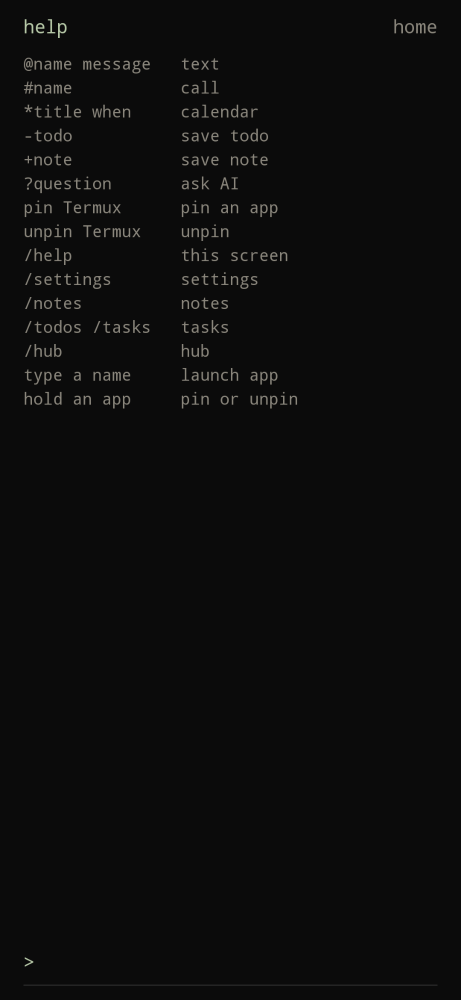

# Builder Launcher

<p align="center">
  
</p>

A simple Android launcher for builders who want to be deliberate with their phone. Open it, do the work, put it down, get back to life off screen.

The home screen is a command bar, not an icon grid. Works on ordinary slab phones and hardware-keyboard devices such as the Unihertz Titan 2 Elite.

AI stays optional and private: point `?` at your own Hermes instance, or sign in to xAI / OpenAI / Anthropic (API key still works as a fallback). Tokens never leave the device except as a Bearer token to the provider you chose.

<p align="center">
  
  
  
</p>

<p align="center">
  
  
  
</p>

| Home | Hub | Settings |
| --- | --- | --- |
| Clock, weather, last 3 todos, command bar | Todos, notes, granted notifications | Hermes, xAI, OpenAI, Anthropic |

| Help | Notes | Prompt |
| --- | --- | --- |
| `/help` — tap or type to leave | `/notes` — `+` to add | `>` menu closes on the first key |

## Install with Obtainium

1. Install [Obtainium](https://github.com/ImranR98/Obtainium/releases).
2. Open this link on the phone (Obtainium must already be installed):

   https://apps.obtainium.imranr.dev/redirect.html?r=obtainium://add/https://github.com/cdrxyz/builder-launcher

3. Confirm these fields if Obtainium asks:

   - App source URL: `https://github.com/cdrxyz/builder-launcher`
   - App ID: `xyz.cdr.builderlauncher`
   - APK filter: `builder-launcher-release`
   - Include prereleases: off (on only if you want APKs from open pull requests)

4. Add the app, install the APK, then open **Builder Launcher**. Android will ask to set it as the default Home app (once). Settings → Set as default home app asks again if you declined.

Sideload without Obtainium: download `builder-launcher-release.apk` from [Releases](https://github.com/cdrxyz/builder-launcher/releases).

## Commands

Type on the home screen, then Enter.

| Prefix | Example | Action |
| --- | --- | --- |
| `@` | `@jason on my way!` | Draft an SMS in the launcher; Enter again to send |
| `#` | `#lauren` | Dial |
| `*` | `*dentist mar 24 9a` | Create a calendar event |
| `-` | `-buy milk` | Save a todo in the hub |
| `+` | `+ship notes` | Save a note in the hub |
| `?` | `?weather tomorrow` | Ask the configured LLM inline |
| (none) | `Termux` | Search and launch apps |
| | `pin Termux` / `unpin Termux` | Pin or unpin on the home list |
| | `/help` | Command list. Tap or type to leave |
| | `/settings` | Settings |
| | `/notes` | Notes list (`+` to add) |
| | `/todos` or `/tasks` | Full task list |
| | `/hub` | Notifications, todos, and notes |

Home always shows the clock, current weather, and up to 3 open todos. Set the weather city in settings (autocomplete, no GPS). Tap a todo to strike it through; tap again to reopen it. `…more tasks >` is always on home and opens the full todos list (no clock; `<` returns home). The command bar there starts in `-` task mode. The copy icon copies open todos to the clipboard as a markdown checklist dated `YYYY-MM-DD` (no share sheet). Finished items sit below open ones, newest completed first. `/notes` opens notes; tap a note to delete it. `/help` is its own screen — tap anywhere or type to return home. The `>` command menu closes on the first keystroke and keeps that character. D-pad right (or type `/hub`) opens the hub: notifications you grant access to, plus local todos and notes. Tap a notification to open it, or dismiss. Hold an app on home to pin or unpin. `@` and `#` complete contacts as you type. Tap the clock for settings.

## AI settings

Settings (tap the clock) → provider:

- **Hermes** — Base URL of your instance (OpenAI-compatible `/v1/chat/completions`). Example: `http://192.168.1.10:8642`. API key optional if the instance does not require one. Cleartext LAN URLs are allowed so a home box works.
- **xAI** — Sign in with SuperGrok / X Premium+ (device-code OAuth at `auth.x.ai`) or paste an API key. Default model `grok-4.6`. Hits `https://api.x.ai/v1`.
- **OpenAI** — Sign in with ChatGPT (browser + paste the code or callback URL) or paste an API key. Default model `gpt-4o`. Hits `https://api.openai.com/v1`.
- **Anthropic** — Sign in with Claude (browser + paste the code) or paste an API key. Default model `claude-sonnet-4-5`. Hits `https://api.anthropic.com`.

OAuth tokens are stored in encrypted prefs on the device and refreshed automatically. Sign out from settings. An API key remains as a fallback if OAuth is unavailable for your plan.

Nothing is sent anywhere until you type `?`. No analytics.

## Keyboard phones

Keyboard mode: `auto` (default), `hardware`, or `software`. Auto treats a hardware QWERTY as present — Titan 2 Elite and most BlackBerry-style Androids. The command bar always sits at the bottom, just above the keyboard. On hardware-keyboard phones the software keyboard stays out of the way.

## Releases and CI

Every pull request builds a signed APK and publishes a **prerelease** tagged `pr-<number>` (replaced on each push to that PR). Merges to `master` publish a latest GitHub Release so Obtainium can update.

## Build from source

JDK 17 and Gradle 8.11.1 are pinned with Hermit (`bin/`). Android SDK 35.

```bash
source bin/activate-hermit
gradle :app:testDebugUnitTest :app:assembleRelease
```

Release signing uses PKCS12 env vars: `ANDROID_KEYSTORE_PATH`, `ANDROID_KEYSTORE_PASSWORD`, `ANDROID_KEY_ALIAS`, `ANDROID_KEY_PASSWORD`.

## License

MIT. Built by [Cedar Labs](https://cdr.xyz).
