# Builder Launcher

<p align="center">
  
</p>

A simple Android launcher for builders who want to be deliberate with their phone. Open it, do the work, put it down, get back to life off screen.

Manual: [Builder Launcher docs](https://cdrxyz.github.io/builder-launcher/) (Starlight on GitHub Pages). Source lives in `website/`.

The home screen is a command bar, not an icon grid. Works on ordinary slab phones and hardware-keyboard devices such as the Unihertz Titan 2 Elite.

AI stays optional and private: point `?` at your own Hermes instance, or sign in to xAI / OpenAI / Anthropic (API key still works as a fallback). Tokens never leave the device except as a Bearer token to the provider you chose.

<p align="center">
  
  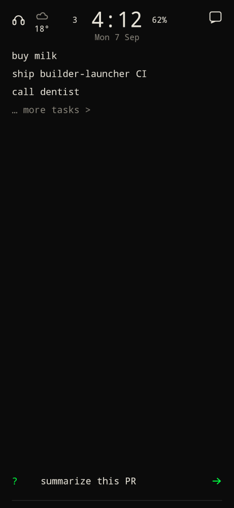
  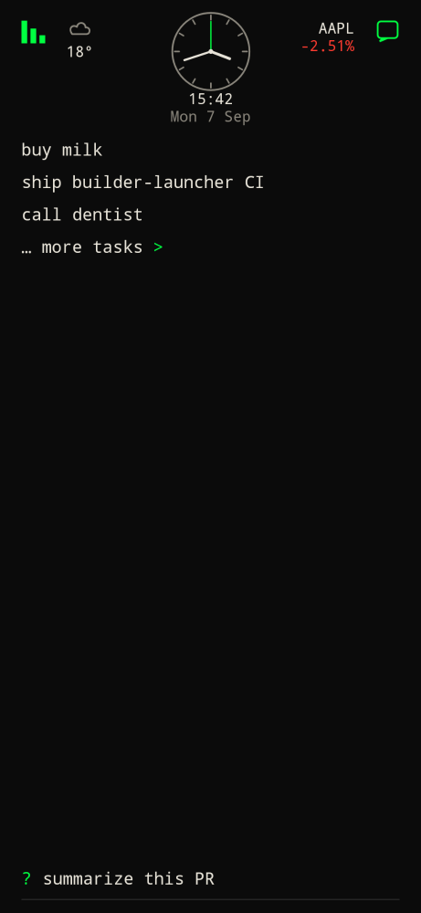
  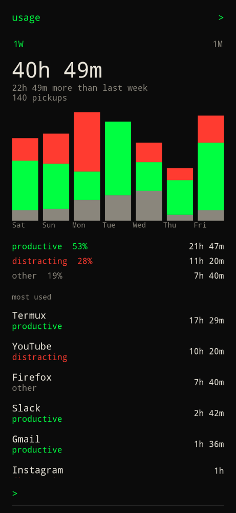
  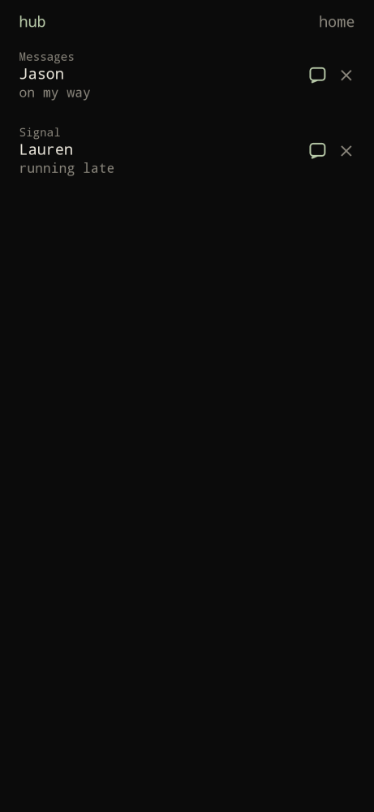
  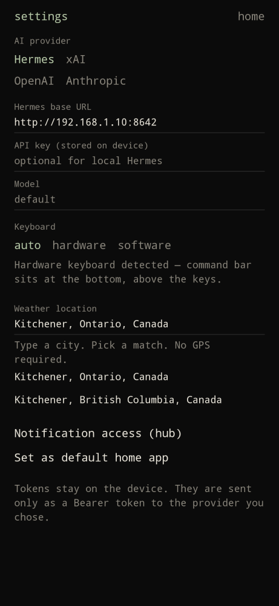
</p>

<p align="center">
  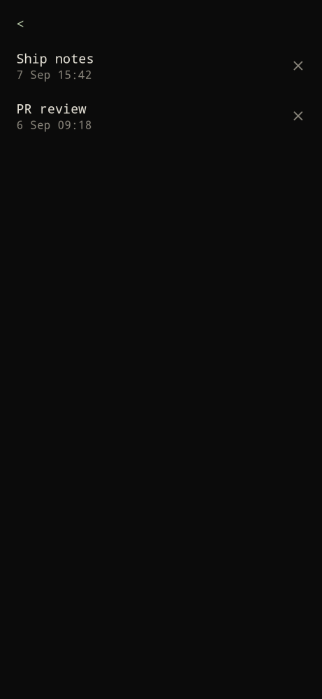
  
  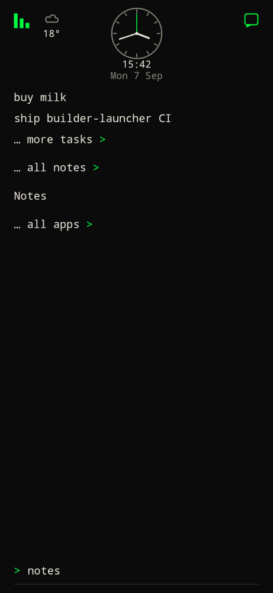" width="240" />
  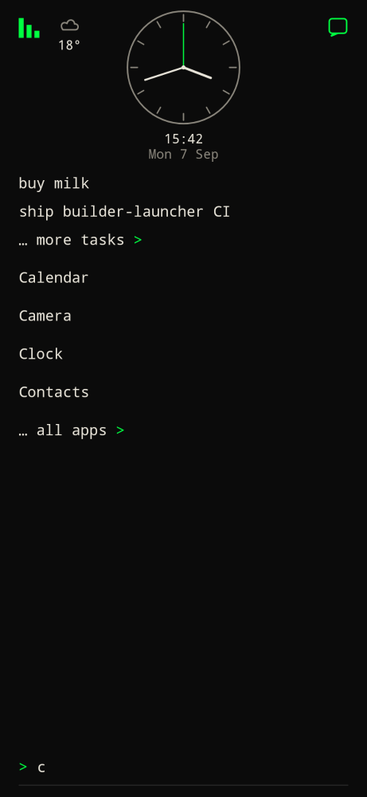" width="240" />
  
</p>

<p align="center">
  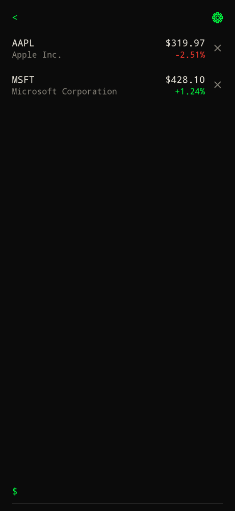
  
  
  
  " width="240" />
  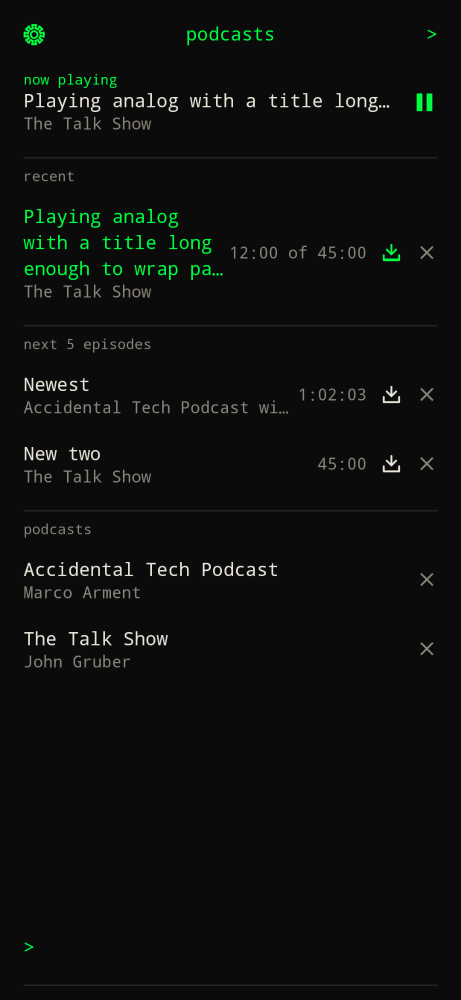
  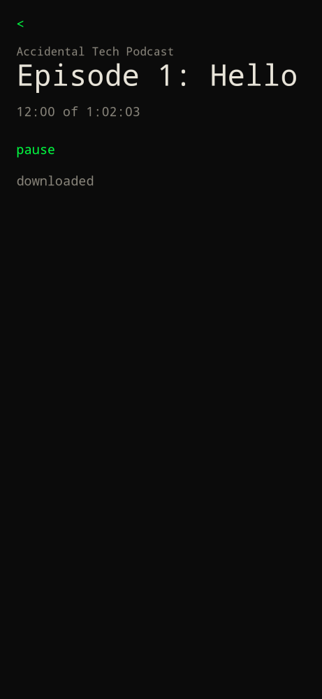
  
  
  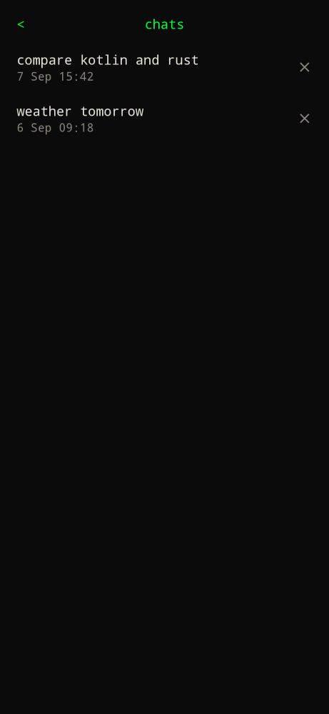
</p>

| Home | Hub | Settings |
| --- | --- | --- |
| Analog clock (timer countdown), next calendar event under the date, weather left, usage mark, rotating ticker, last 3 todos, messages icon, command bar | Messages you can reply to | Hermes, xAI, OpenAI, Anthropic |

## Install with Obtainium

1. Install [Obtainium](https://github.com/ImranR98/Obtainium/releases).
2. Open this link on the phone (Obtainium must already be installed):

   https://apps.obtainium.imranr.dev/redirect.html?r=obtainium://add/https://github.com/cdrxyz/builder-launcher

3. Confirm these fields if Obtainium asks:

   - App source URL: `https://github.com/cdrxyz/builder-launcher`
   - App ID: `xyz.cdr.builderlauncher`
   - APK filter: `builder-launcher-release`
   - Include prereleases: off (on only if you want APKs from open pull requests)

4. Add the app, install the APK, then open **Builder Launcher**. Android will ask to set it as the default Home app (once). Settings → Set as default home app asks again if you declined.

Sideload without Obtainium: download `builder-launcher-release.apk` from [Releases](https://github.com/cdrxyz/builder-launcher/releases).

## Commands

Type on the home screen, then Enter.

| Prefix | Example | Action |
| --- | --- | --- |
| `@` | `@jason on my way!` | Draft an SMS in the launcher; Enter again to send |
| `#` | `#lauren` | Dial |
| `*` | `*dentist mar 24 9a` | Create a calendar event |
| `-` | `-buy milk` | Save a todo on home and the tasks list |
| `+` | `+` then write | Full-screen markdown note; first line starts as `# ` h1. `<` saves and goes home |
| | `notes` | Open all notes. App search shows `… all notes >` so it is not an installed Notes app |
| | `apps` | Open all installed apps. App search truncates and always ends with `… all apps >` |
| `$` | `$AAPL` or `$ apple` | Search and add a ticker to the stocks list |
| | `stocks` | Open all stocks. App search shows `… all stocks >` |
| | `podcasts` | Open all podcasts. App search shows `… all podcasts >` |
| `?` | `?` then write | Full-screen AI chat. Markdown answers (tables, lists, code). `<` home; tap the provider mark to open Grok/ChatGPT/Claude/Hermes with the prompt; long-press it to switch providers; history icon lists past chats with a date and delete |
| `/` | `/` then pick `settings` | Slash commands listed above the bar (apps, clock, help, hub, notes, podcasts, settings, stocks, usage, weather) |
| (none) | `Termux` | Search and launch apps |
| | `pin Termux` / `unpin Termux` | Pin or unpin. Names on home; icons if settings says so |
| | `hub` / `notes` / `apps` / `stocks` / `podcasts` / `clock` / `weather` / `usage` / `settings` / `help` | Built-ins |

Swipe up to Home (or the Home button) while already in the launcher returns to this home screen. Home from another app restores the last launcher page (tasks, hub, notes, and so on). Back from an inner page returns home; Back on home resets the command bar to normal `>` mode.

Home always shows a centered analog clock (digital time and date below; settings can switch to digital only), the next calendar event under the date when calendar access is granted, current weather as a condition icon over the temperature on the left, a headphones mark beside it while a podcast is playing, a usage chart mark at the top left, and up to 3 open todos. If the watchlist is not empty, one ticker and today's percent sit to the right of the clock and rotate every 5 seconds; tap it for that ticker's chart. Set the weather city and metric or imperial units in settings (autocomplete, no GPS). Tap a todo to strike it through; tap again to reopen it. `… more tasks >` is always on home and opens the full todos list (no clock; `<` returns home). The command bar there starts in `-` task mode. The copy icon copies open todos to the clipboard as a markdown checklist dated `YYYY-MM-DD` (no share sheet). Delete on the right permanently removes a task. Pencil before delete loads the task into the bar to edit. Long-press and drag an open row to reorder; home preview stays tap-only. Finished items sit below open ones, newest completed first. Type `+` to expand a full-screen markdown note. The first line is seeded with `# ` (`<` home, copy icon top right). Type `notes` (or tap `… all notes >` in the filtered app list) for notes sorted by date edited; first line is the title, delete on the right. Type `$` (or `stocks`, or tap `… all stocks >`) for the watchlist: ticker, company, price, and today's % change. Type `$AAPL` or `$ apple` to search and add. Delete on the right removes a ticker. Long-press and drag a row across the list to reorder. The gear opens stocks settings: new tickers top or bottom, copy list, paste to add, or replace the list. Copy writes `Exchange,Ticker,Name`. Paste accepts that CSV, an Apple Stocks `Symbol,Name,…` export, or one ticker per line. Enter a CSV in the bar still imports. Tap a row for a chart with 1D / 1W / 1M / 3M / 1Y / 5Y and a stats box. Type `podcasts` (or tap `… all podcasts >`) to search shows, subscribe, stream, and download. Unfinished plays (up to 3) sit first, then 5 new episodes, then subscriptions A–Z. Scrub, −15/+15, and a 1×–3× speed bar are on the episode. Gear sets a download cache (default 5 GB; oldest files delete first) and pastes Overcast OPML. Type an app name to filter a short, non-scrolling list that always ends with `… all apps >`. That opens every installed app (icons on the left; info for system app settings and delete to uninstall on the right). The command bar there filters the list as you type. The usage chart (top left), a swipe from the left, D-pad left, or `usage` opens screen time. The messages icon (top right), a swipe from the right, D-pad right, or `hub` opens the hub: SMS and chat threads you can answer. Reply (arrow on the right) sends through the notification when the app allows it; otherwise it opens the same screen as tapping the row (typical for Signal and Molly). Dismiss (x on the right) clears the notification. Todos stay on home and `… more tasks >`; notes stay on `notes`; stocks stay on `stocks`; podcasts stay on `podcasts`. Type `?` to open a full-screen AI chat (`<` home; history icon for past conversations with a date and delete). Hold an app in search or all apps to pin or unpin. Pinned apps sit as names on home (settings → Home apps → icons for a row of icons); hold and drag to reorder. `@` and `#` complete contacts as you type. Tap the clock for timer, alarm, and time zones. Tap the next event under the date to open it. Tap the weather mark for the forecast. Type `settings` for settings.

## AI settings

Settings (`settings` or `/settings`) → **… AI providers >**:

- **Hermes** — Web UI URL, example `http://192.168.1.10:8787`. Paste the Web UI password. `?` logs in for a session cookie and also sends `Authorization: Bearer` when a password is set. If that host is `hermes dashboard` (`:9119`) and login 401s, `?` retries the API server on `:8642` with the same password. **Open question in**: **web ui** opens that URL; **hermex** shares the question into Hermex (`com.uzairansar.hermex`). Changing provider, URL, password, or model runs an access test. Password optional if the instance is open. Cleartext LAN URLs are allowed so a home box works.
- **xAI** — Sign in with SuperGrok / X Premium+ (device-code OAuth at `auth.x.ai`) or paste an API key. Default model `grok-4.6`. Hits `https://api.x.ai/v1`.
- **OpenAI** — Paste an API key. Default model `gpt-4o`. Hits `https://api.openai.com/v1`.
- **Anthropic** — Paste an API key. Default model `claude-sonnet-4-5`. Hits `https://api.anthropic.com`.
- **Gemini** — Google AI Studio key. Default `gemini-2.5-flash`.
- **OpenRouter** — OpenRouter key. Default `openrouter/auto`.
- **Groq / DeepSeek / Mistral** — Provider API keys.
- **LM Studio** — Local server, default `http://127.0.0.1:1234/v1`.
- **Ollama** — Local server, default `http://127.0.0.1:11434/v1`.
- **OpenAI API** — Any OpenAI-compatible host: base URL + key.

OAuth tokens are stored in encrypted prefs on the device and refreshed automatically. Each provider keeps its own sign-in. If Hermes is selected and unreachable, `?` falls back to a connected cloud account and notes that above the reply. Sign out from settings. An API key remains as a fallback if OAuth is unavailable for your plan.

Nothing is sent anywhere until you type `?`. No analytics.

## Backup

Settings → Backup. Optional S3-compatible snapshot (R2, AWS, B2, MinIO): endpoint, bucket, access key, secret key, encryption key, frequency `off` / `daily` / `weekly`. Encrypted on the phone before upload. Restore replaces local todos, notes, chats, pins, stocks, podcasts, alarms, and settings. **Share unencrypted JSON** uses the Android share sheet (email, Signal, another program) and omits keys and tokens.

## Keyboard phones

Keyboard mode: `auto` (default), `hardware`, or `software`. Auto treats a hardware QWERTY as present — Titan 2 Elite and most BlackBerry-style Androids. On a slab phone the software keyboard stays open under the command bar. On hardware-keyboard phones it stays out of the way.

## Releases and CI

Every pull request builds a signed APK and publishes a **prerelease** tagged `pr-<number>` (replaced on each push to that PR). Merges to `master` publish a latest GitHub Release so Obtainium can update.

## Build from source

JDK 17 and Gradle 8.11.1 are pinned with Hermit (`bin/`). Android SDK 35.

```bash
source bin/activate-hermit
gradle :app:testDebugUnitTest :app:assembleRelease
```

Release signing uses PKCS12 env vars: `ANDROID_KEYSTORE_PATH`, `ANDROID_KEYSTORE_PASSWORD`, `ANDROID_KEY_ALIAS`, `ANDROID_KEY_PASSWORD`.

## License

MIT. Built by [Cedar Labs](https://cdr.xyz).
