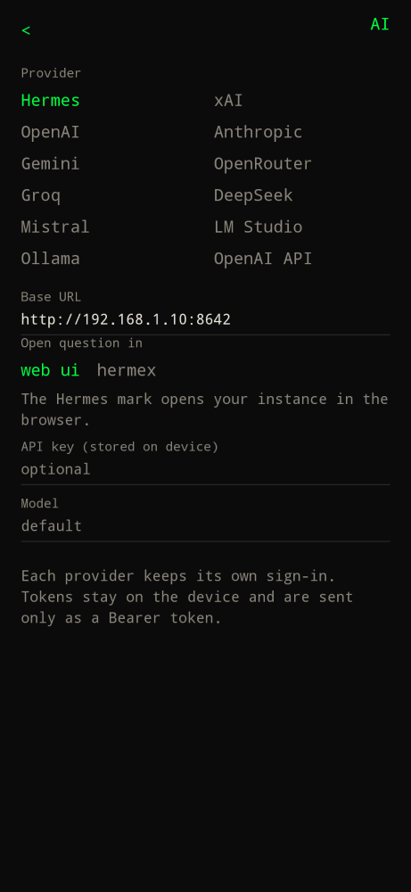

Type `settings` → **… AI providers >**.

Each account stays on the device when you switch. If Hermes is selected and the instance is unreachable, `?` tries a connected cloud account and shows **Fell back to Grok** (or ChatGPT / Claude / Gemini / …) above the reply.

## Hermes

Base URL of your instance (OpenAI-compatible `/v1/chat/completions`). Example: `http://192.168.1.10:8642`. API key optional if the instance does not require one. Cleartext LAN URLs are allowed so a home box works.

**Open question in** chooses where the Hermes mark on `?` chat sends the current prompt:

- **web ui** (default) — opens your Hermes URL in the browser.
- **hermex** — shares the question into the Hermex app the same way Grok gets `ACTION_SEND`. Hermex does not take a `?q=` deep link; `hermex://new-chat` and `hermes-agent://new-chat` only open a blank composer. If Hermex is not installed, the mark falls back to your Hermes URL.

## xAI

Sign in with SuperGrok / X Premium+ (device-code OAuth at `auth.x.ai`) or paste an API key.

Default model `grok-4.6`. Hits `https://api.x.ai/v1`.

## OpenAI

Paste an API key. Default model `gpt-4o`. Hits `https://api.openai.com/v1`.

## Anthropic

Paste an API key. Default model `claude-sonnet-4-5`. Hits `https://api.anthropic.com`.

## Gemini

Paste a Google AI Studio key. Default model `gemini-2.5-flash`. Uses the OpenAI-compatible Gemini endpoint.

## OpenRouter

Paste an OpenRouter key. Default model `openrouter/auto`. Hits `https://openrouter.ai/api/v1`.

## Groq / DeepSeek / Mistral

Paste the provider API key. Defaults: `llama-3.3-70b-versatile`, `deepseek-chat`, `mistral-small-latest`.

## LM Studio

Local OpenAI-compatible server. Default URL `http://127.0.0.1:1234/v1`. Start the server in LM Studio (LM Studio Link / local server). Key optional.

## Ollama

Local OpenAI-compatible server. Default URL `http://127.0.0.1:11434/v1`. Key optional.

## OpenAI API

Any OpenAI-compatible host. Set the base URL and API key. HTTPS anywhere; HTTP only to private LAN hosts.

## Tokens

OAuth tokens (xAI) are stored in encrypted prefs on the device and refreshed automatically. An API key remains as a fallback if OAuth is unavailable for your plan.

See [Privacy](privacy/).
