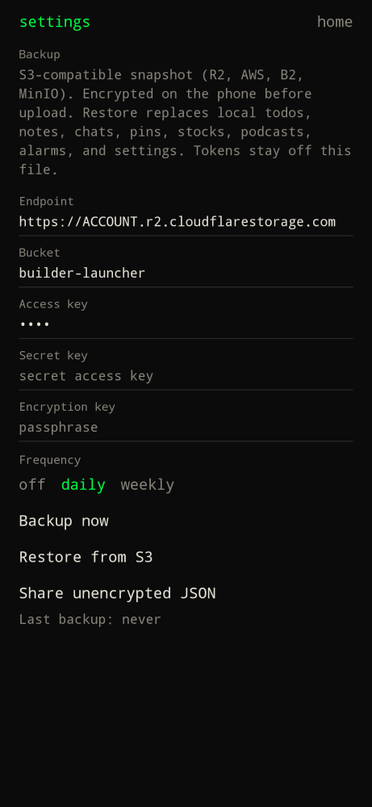

Type `settings` or `/settings`, then scroll to **Backup**.

This is a snapshot, not two-way sync. The last successful upload wins. Restore replaces what is on the phone.

| Field | What it is |
| --- | --- |
| Endpoint | S3-compatible URL. R2 example: `https://ACCOUNT.r2.cloudflarestorage.com`. Also AWS, B2, MinIO. |
| Bucket | Bucket name. Object key is always `builder-launcher/backup.enc`. |
| Access key / Secret key | IAM or R2 API token. Stored in encrypted prefs on the phone. |
| Encryption key | Passphrase. The JSON is AES-GCM encrypted on the phone before upload. Lose it and the blob is unreadable. |
| Frequency | `off`, `daily`, or `weekly`. Daily/weekly run when you open the launcher if a backup is due. |

**Backup now** uploads. **Restore from S3** asks once, then replaces todos, notes, chats, pins, watchlist, podcast subscriptions, alarms, world clocks, and settings. OAuth tokens and S3 credentials on this phone are left alone. The encrypted snapshot may include the current provider API key.

**Share unencrypted JSON** opens the Android share sheet with a plaintext dump (Signal, email, another program). No API keys, OAuth tokens, or S3 secrets.

S3 is optional. Leave the fields blank and nothing leaves the device.
