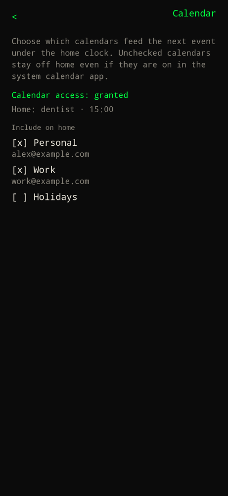

Type `settings` or `/settings`, then **… calendar >**.

Home shows one next event under the date. This screen is how you turn that on and choose the calendars.

| Piece | What it does |
| --- | --- |
| Calendar access | `granted` or `not granted`. The launcher asks with contacts on first open. If you denied it, tap **Grant calendar access**. If Android will not ask again, tap **Open Android settings** and enable Calendar for Builder Launcher. |
| Home line | Confirms the event that will sit under the clock, or that nothing is upcoming in the next 14 days. |
| Include on home | Check the calendars that should feed that line. Unchecked calendars stay off home even if they are on in the system calendar app. Hidden system calendars stay off until you check them here. |

The selection stays on the phone. Recurring meetings are included. Tap the home line to open that event.

`*` still creates events in the system calendar app. It does not write the calendar itself.

See [Calendar](../use/calendar/) for the `*` command and the home line format.
