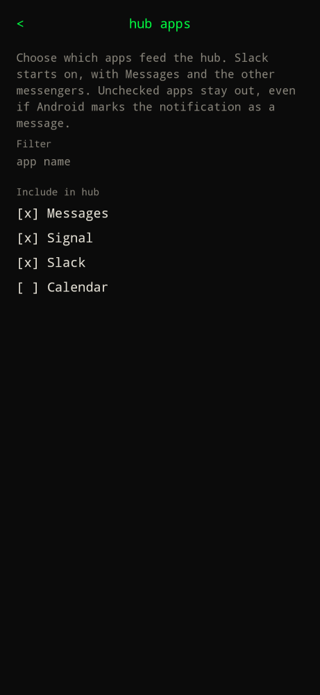

Type `settings` or `/settings`, then **… hub apps >**.

The hub is the notification inbox. This screen is how you choose which apps are allowed in.

| Piece | What it does |
| --- | --- |
| Filter | Narrows the list by app name. |
| Include in hub | Check the apps that should appear. Slack starts on, with Messages, Signal, and the other built-in messengers. Unchecked apps stay out even if Android marks the notification as a message. |

The selection stays on the phone. It is not part of account sync.

Grant **Notification access (hub)** on the settings screen or the hub stays empty. See [Hub](../use/hub/) for reply, dismiss, and how to open it.
