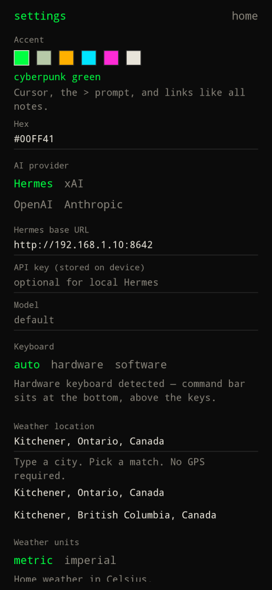

Tap the clock on home, or type `settings`.

| Block | What to set |
| --- | --- |
| AI provider | Hermes, xAI, OpenAI, Anthropic. [Details](ai-providers/). |
| Hermes base URL | Only for Hermes. Example `http://192.168.1.10:8642`. |
| Sign in / API key | xAI SuperGrok device login, or paste a key. Keys stay on device. |
| Model | Blank uses the provider default. |
| Accent | Color chips for the cursor, `>` prompt, selected chips, and links. Default cyberpunk green. |
| Keyboard | `auto`, `hardware`, or `software`. [Keyboard](keyboard/). |
| Weather location | Type a city, pick a match. Placeholder: New York. No GPS required. |
| Weather units | `metric` (Celsius) or `imperial` (Fahrenheit). |
| Notification access (hub) | Opens Android's notification listener settings. |
| Set as default home app | Asks Android again if you declined the first prompt. |

Footer: tokens stay on the device and are sent only as a Bearer token to the provider you chose.
