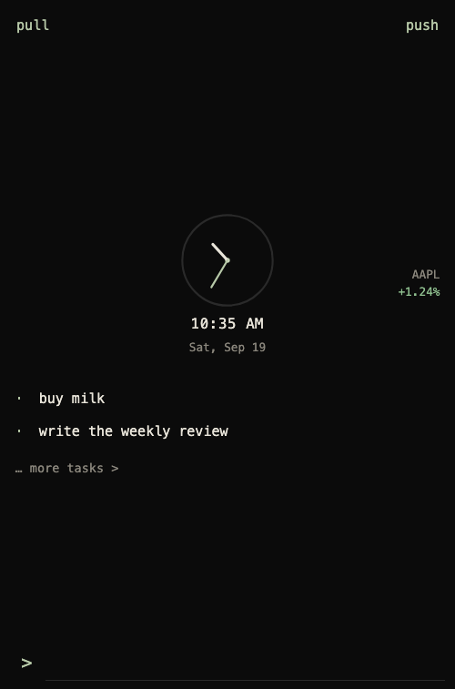

Open **[builder.cdr.xyz](https://builder.cdr.xyz)**. Add to Home Screen on iPhone, or install as an app on a laptop. No npm, no GitHub Pages CORS.

It uses the **same S3 fields as the phone**: endpoint, bucket, access key, secret key, encryption key. Credentials stay in this browser. They are posted only to the Builder Launcher Worker, which talks to your bucket (SigV4) at `builder-launcher/backup.enc`. Decrypt still happens in the browser.

This is a snapshot, not two-way file sync. The last successful upload wins. Restore on the phone replaces local todos, notes, watchlist, and podcasts with that snapshot.

## First load

1. On the phone: Settings → **… backup >**. Fill S3 and encryption key. **Backup now**.
2. Open [builder.cdr.xyz](https://builder.cdr.xyz), paste the same five fields, **save & pull**.
3. Safari: Share → Add to Home Screen. Chrome/desktop: Install app.

The Worker origin is `https://builder.cdr.xyz` (also `https://builder-launcher.cdrxyz.workers.dev`). The bucket does **not** need CORS.

A static copy still ships on GitHub Pages at `/web/` if you want it. That copy talks to S3 from the browser and needs CORS; prefer the Cloudflare host.

## What it shows

Home matches the phone: analog clock, up to 3 open tasks, `… more tasks >`, and a command bar at the bottom. The **glyph on the left** holds the prefix (`>`, `-`, `+`, `$`, `/`). The field stays empty. Tap the glyph for the prefix menu. Type `/` for slash commands (`notes`, `stocks`, `podcasts`, `settings`, `tasks`, `pull`, `push`).

- **tasks** — full list. Command bar starts in `-`.
- **notes** — listed by date edited. Command bar starts in `+`.
- **stocks** — watchlist. Command bar starts in `$`.
- **podcasts** — recent, next episodes, subscriptions. Type a show name or RSS URL in `>` mode.
- **settings** — S3 fields, save & pull, open file, forget.
- **pull** / **push** — also on the home header. Last upload wins.

Offline, the last pulled snapshot stays on the device. Pull again when you are back on the network.

## Privacy

S3 keys and the encryption key are stored in `localStorage` on that browser. **forget** clears them. The Worker does not keep the keys. API keys inside a snapshot are not shown in the UI.
