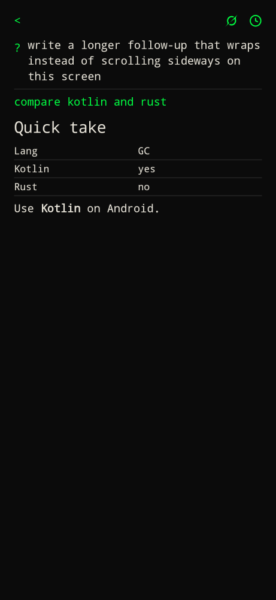
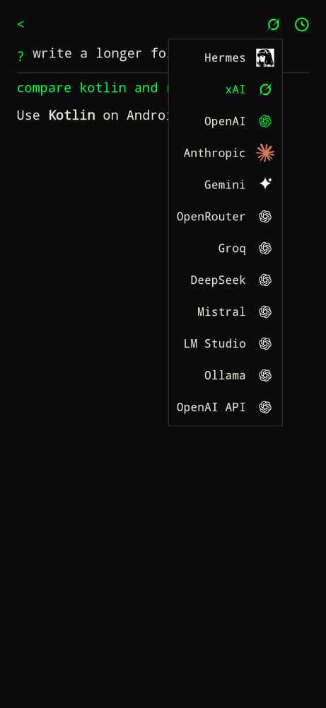

Prefix `?`. Pick it from the command menu, or type `?` then a question.

Nothing is sent anywhere until you submit a question. There is no analytics.

1. Configure a provider in [AI providers](../configure/ai-providers/).
2. Type `?` on home. The full-screen chat opens.
3. Write the question in the bar at the top. Long questions wrap. Enter sends. Follow-ups stay in the same thread.
4. The reply streams in below. A short `…` shows until the first token arrives.

`<` top left returns home. Top right: the provider mark (Grok, ChatGPT, Claude, Gemini star, or Hermes) copies the current prompt and opens that app pre-filled so you can send it there. For Hermes, settings **Open question in** picks the Web UI (default) or Hermex share. Long-press the mark for a menu of provider names with logos on the right, aligned under the mark; tap a row to switch. History opens past conversations. Tap a question or a reply to copy it (toast: Copied).

Answers render markdown: headings, lists, tables, fenced code, bold and italic.

History lists the first line of each question, with the date edited underneath and delete on the right. Tap a row to reopen it. Empty chats are not saved.

A lone `?` opens chat. `help` or `/help` is the command cheat sheet.

| Provider | Default model | Endpoint |
| --- | --- | --- |
| Hermes | `default` (whatever your instance serves) | Hermes Web UI URL. `?` logs in with the Web UI password and chats through `/api/chat/start`. |
| xAI | `grok-4.6` | `https://api.x.ai/v1` |
| OpenAI | `gpt-4o` | `https://api.openai.com/v1` |
| Anthropic | `claude-sonnet-4-5` | `https://api.anthropic.com` |

Override the model in settings. Cleartext LAN URLs are allowed so a home Hermes box works.
