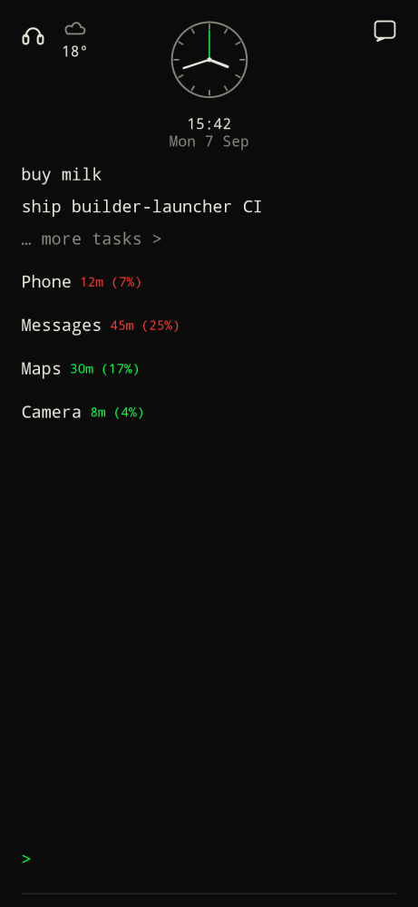

## Search from home

Type an app name (no prefix). Home hides the todo preview and shows a short, non-scrolling list of matches (up to five) that **always** ends with `… all apps >`.

- Tap a match to launch it. Pinning only happens if the line starts with `pin` or `unpin`.
- Several matches: pick from the list.
- No matches: "No app matches".
- `pin Termux` filters by the rest of the line; tap a match to pin. Same for `unpin`.
- **Hold** an app row in search or on all apps to pin or unpin.

Home search is names only by default. Settings → **Home apps** → `icons` puts a grayscale icon next to each match.

## Pins

Default: names in a vertical list on home.

Settings → **Home apps** → `icons` switches pins to a centered horizontal row of grayscale icons. All apps keeps color.

**Pin time** (`off` by default, under Home apps) puts today's minutes and share of phone time under each pin, as `30m` then `17%` on the next line. Green if the app is marked productive, red if not. Grant usage access first. Tap `/usage` to change productive / distracting / other.

- Tap a name or icon to launch.
- Hold and drag to reorder. Order is saved on the device.

## All apps

Type `apps` (or tap `… all apps >`). Every installed app is listed with an icon on the left.

- Tap a row to launch.
- **Info** opens system app settings.
- **Delete** starts uninstall (where Android allows it).
- The command bar on this page filters as you type.

`<` returns home.
