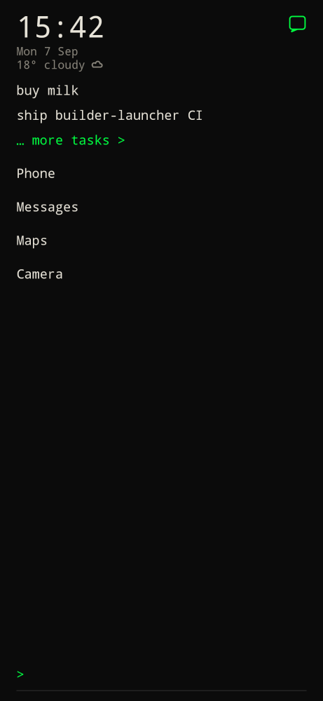
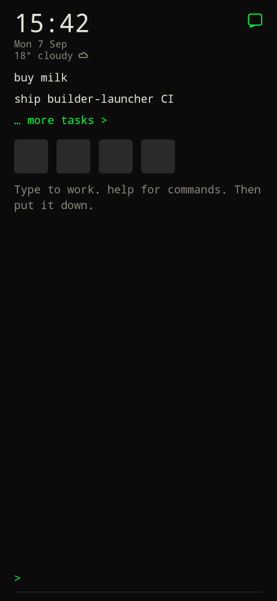
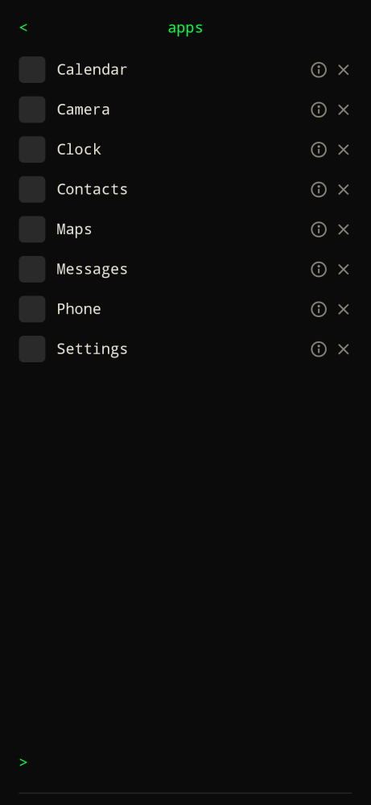
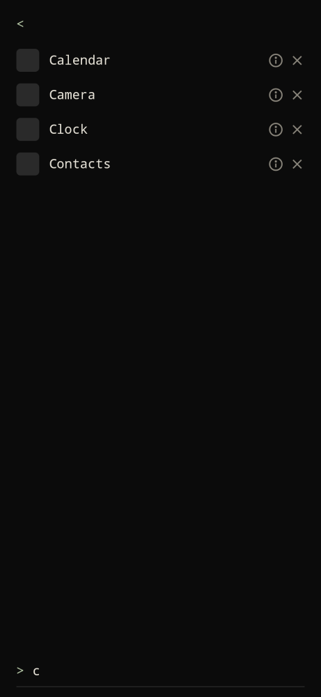

## Search from home

Type an app name (no prefix). Home shows a short, non-scrolling list of matches (up to five) that **always** ends with `… all apps >`.

- Tap a match to launch it.
- Several matches: pick from the list.
- No matches: "No app matches".
- `pin Termux` / `unpin Termux` pin without launching.
- **Hold** an app row in search or on all apps to pin or unpin.

Home search is names only by default. Settings → **Home apps** → `icons` puts an icon next to each match.

## Pins

Default: names in a vertical list on home.

Settings → **Home apps** → `icons` switches pins to a horizontal row of icons.

- Tap a name or icon to launch.
- Hold and drag to reorder. Order is saved on the device.

## All apps

Type `apps` (or tap `… all apps >`). Every installed app is listed with an icon on the left.

- Tap a row to launch.
- **Info** opens system app settings.
- **Delete** starts uninstall (where Android allows it).
- The command bar on this page filters as you type.

`<` returns home.
