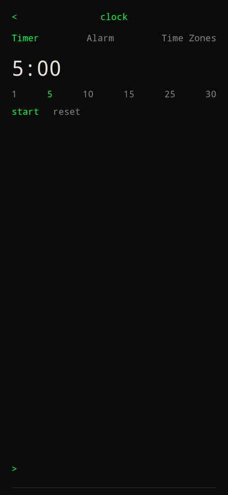

Tap the time on [home](home/), or type `clock` / `/clock`.

Three tabs:

| Tab | What it does |
| --- | --- |
| Timer | Presets 1 / 5 / 10 / 15 / 25 / 30 minutes. Start, pause, reset. Type `5` or `1:30` in the bar. |
| Alarm | Type `7:30` or `7:30am` to add. Tap a row to enable or disable. Delete on the right. |
| Time Zones | Type a city, pick a match. Shows local time and offset from here. Hold and drag a row across the list to reorder. Delete on the right. |

Alarms and the running timer fire a notification even if you leave the screen. `<` returns home.

Settings stay on `settings` / `/settings` — the clock is no longer the settings shortcut.
