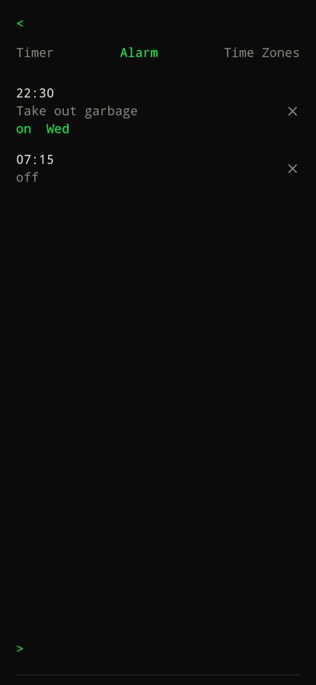
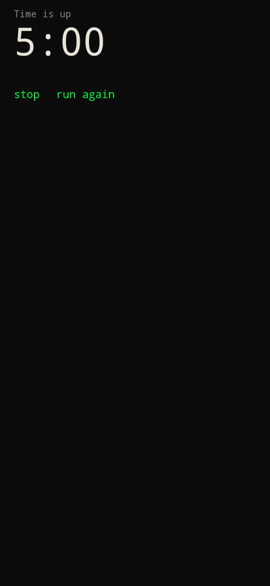
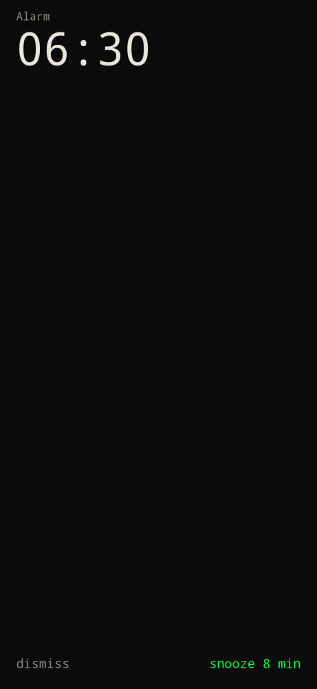

Tap the time on [home](home/), or type `clock` / `/clock`. Home shows an analog clock in the center by default (digital time and date below). Switch to digital in [settings](../../configure/settings/).

Three tabs:

| Tab | What it does |
| --- | --- |
| Timer | Presets 1 / 5 / 10 / 15 / 25 / 30 minutes. Start, pause, reset. Type `5`, `8 minutes`, or `Pasta 8 minutes` in the bar. |
| Alarm | Type `7:30am` or `Take out garbage Wednesdays 10:30pm`. Labels and weekdays stick on the row. Tap a row to enable or disable. Delete on the right. |
| Time Zones | Type a city, pick a match. Shows local time and offset from here. Hold and drag a row across the list to reorder. Delete on the right. |

While the timer is running, home replaces the large clock with the countdown. Tap it to return here.

Timers, alarms, and time zones stay on the device across app launches. A running timer keeps counting; enabled alarms still fire after a reboot.

Alarms and the running timer play a real Android ringtone on the alarm stream, even if the phone is on silent or vibrate. The clip loops and fades in over 4 seconds. Pick `pulse`, `chime`, `bell`, `orthodox`, `hum`, or `off` in [settings](../../configure/settings/) — tap a name to hear it. `<` returns home.

| When | Prompt |
| --- | --- |
| Timer | `stop` or `run again` (same duration). |
| Alarm | `dismiss` or `snooze 8 min`. |

Settings stay on `settings` / `/settings` — the clock is no longer the settings shortcut.
