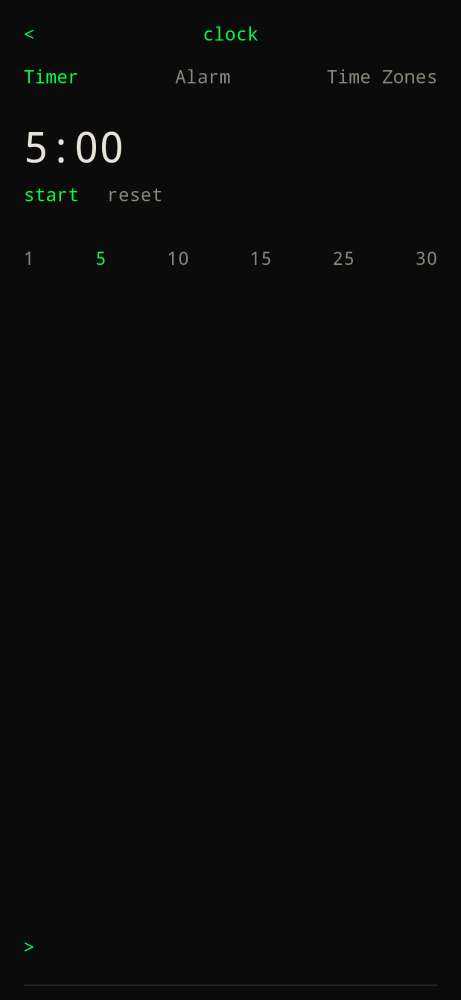
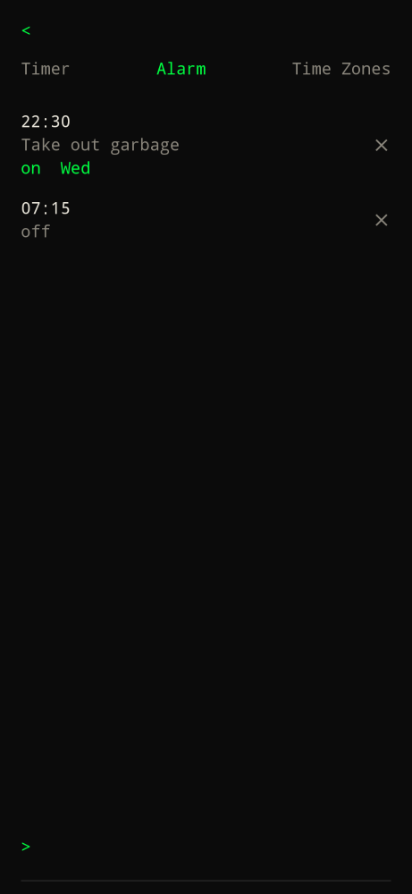
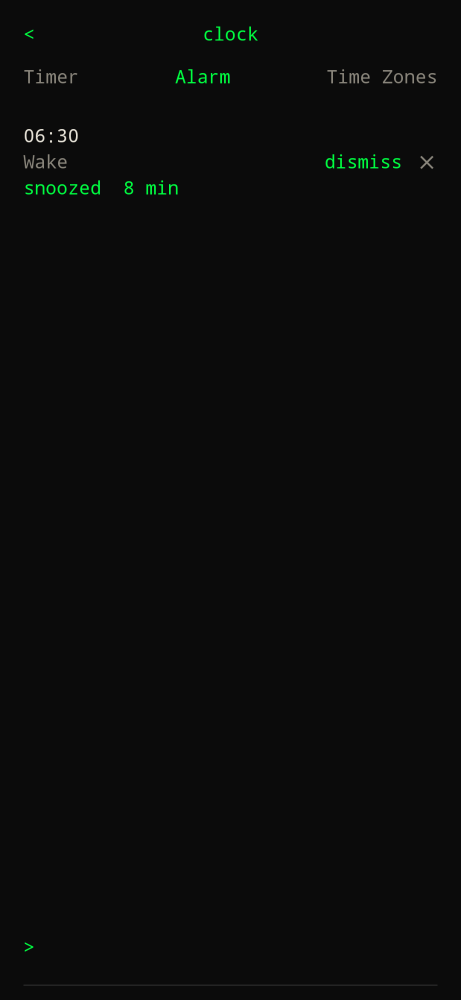
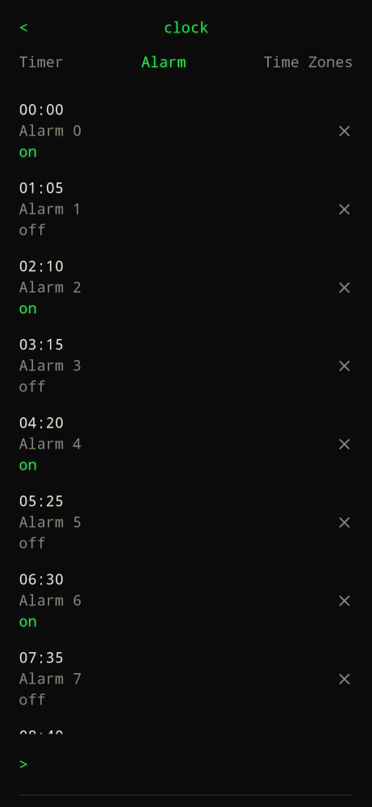
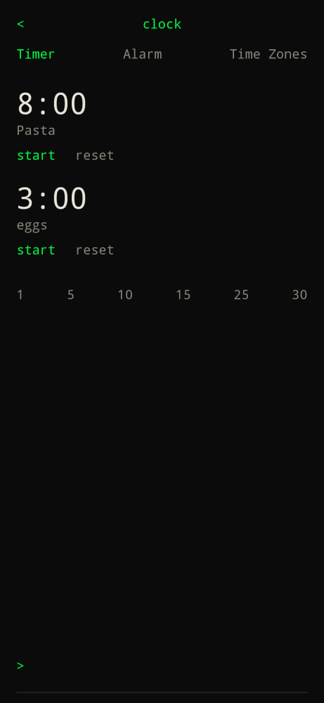
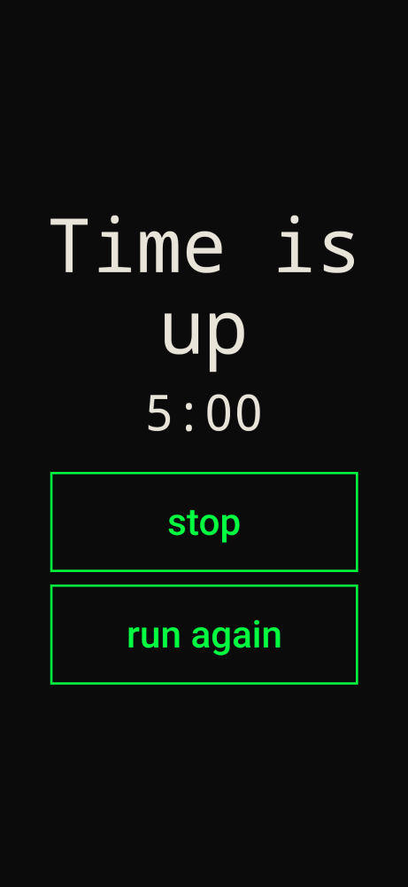
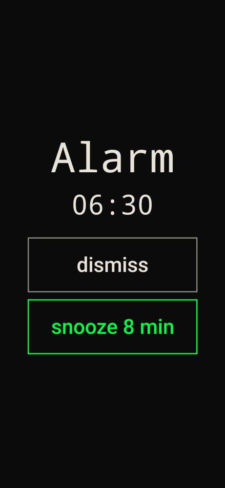

Tap the time on [home](home/), or type `clock` / `/clock`. Home shows an analog clock in the center by default (digital time and date below). Todos completed today sit to the left of the face; today's productive share sits to the right. Switch to digital in [settings](../../configure/settings/).

Three tabs:

| Tab | What it does |
| --- | --- |
| Timer | Presets 1 / 5 / 10 / 15 / 25 / 30 minutes. Start, pause, reset on each row. Type `5`, `8 minutes`, or `Pasta 8 minutes` in the bar. A labeled line adds another timer instead of replacing the one that is already counting. The pane scrolls if the keyboard covers start or reset. |
| Alarm | Type `7:30am`, `Take out garbage Wednesdays 10:30pm`, or `Advil every 4 hours starting at 8pm`. Labels and weekdays stick on the row. An interval adds one daily alarm at each step from that time — 8pm, 12am, 4am, 8am, 12pm, 4pm — all with the same label. The gap has to divide the day evenly, and it will not add more than 24 alarms. The list scrolls. Tap a row to enable or disable. A snoozed row says how many minutes are left and has `dismiss`, which cancels that ring and keeps the next scheduled time. Delete on the right removes it, including from a signed-in account. |
| Time Zones | Type a city, pick a match. Shows local time and offset from here. The list scrolls. Hold and drag a row across the list to reorder. Delete on the right. |

A snoozed alarm stays on the list with the minutes left and dismiss.

A long alarm list stays above the command bar and scrolls.

A labeled line adds another timer instead of replacing the one that is already counting.

While a timer is running, home replaces the large clock with the soonest countdown. Tap it to return here. A snooze does the same: the large time is the minutes left, and a tap opens the alarm list so that row's dismiss is there.

Timers, alarms, and time zones stay on the device across app launches. A running timer keeps counting, including after account sync. Enabled alarms still fire after a reboot. If home opens after the alarm time (phone off, or the launcher woke late), it still rings for up to 2 hours, unless that ring was dismissed. Dismiss ends this occurrence. It does not ring again until the next scheduled time, including after account sync. When a timer finishes it uses the same full-screen alert as an alarm: `stop` or `run again`.

Alarms and the running timer play a real Android ringtone on the alarm stream, even if the phone is on silent or vibrate. The clip loops and fades in over 4 seconds. Pick `pulse`, `chime`, `bell`, `orthodox`, `hum`, or `off` in [settings](../../configure/settings/) — tap a name to hear it. Orthodox is a public-domain chant. `<` returns home.

| When | Prompt |
| --- | --- |
| Timer | `stop` or `run again` (same duration). |
| Alarm | `dismiss` stops it. `snooze 8 min` rings again in 8 minutes. The name is large. Both actions sit in the middle of the space still on screen: above the software keyboard, or in the middle of the display when that keyboard is closed or the phone has a hardware keyboard. The same screen opens when the phone is unlocked, including when a snooze ends, so the alarm can be stopped without opening the notification. |

If the phone is locked or the screen is off, that same full-screen alert opens over the lock. Dismiss or snooze returns to the lock screen. Unlocked home still covers the command bar with the same screen. If it only shows as a notification, allow full-screen notifications for Builder Launcher in Android settings.

Settings stay on `settings` / `/settings` — the clock is no longer the settings shortcut.
