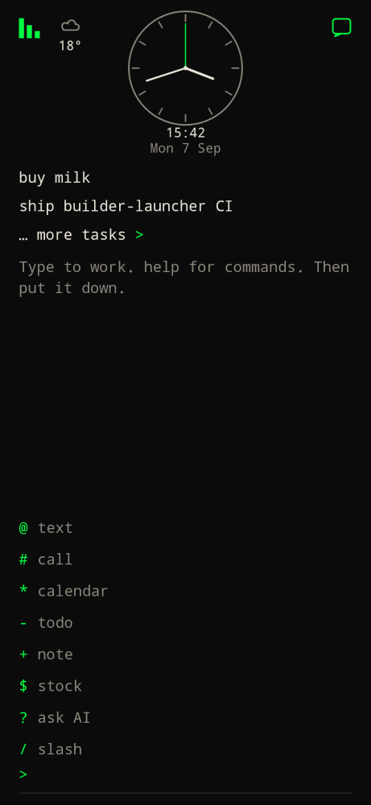
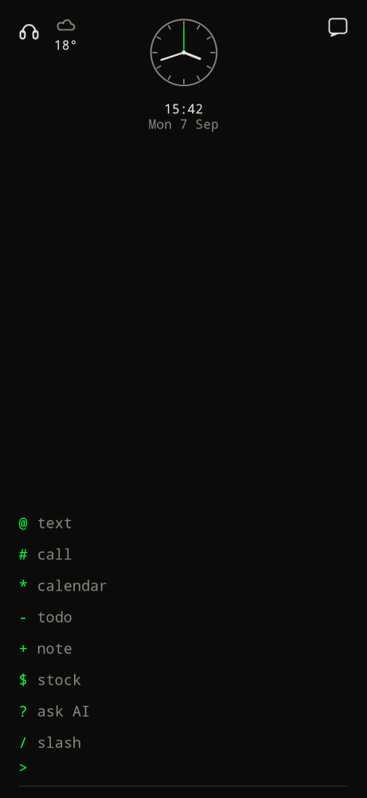

The prompt is always at the bottom, just above the keyboard (or the hardware keys).

- Type, then **Enter** / Go.
- **D-pad right** opens the [hub](hub/). **D-pad left** opens [usage](usage/).
- Tap `>` (empty bar) to open the prefix menu.
- The **glyph holds the prefix**. The field stays empty so `$` mode is the prompt, not text in the box.

| Glyph | Label |
| --- | --- |
| `@` | text |
| `#` | call |
| `*` | calendar |
| `-` | todo |
| `+` | note |
| `$` | stock |
| `?` | ask AI |
| `/` | slash |

Picking a row sets the prompt glyph. Type the rest of the command in the field. Pick **slash** to list slash commands above the bar.

Software keyboards keep autocorrect **off** in default `>` mode so live calculator expressions (`2+2`, `3*7`) are not rewritten. Autocorrect turns **on** for `-` todos, `+` notes, and `?` AI, and in the full-screen note editor.

On hardware QWERTY, auto mode hides the software keyboard so the bar sits next to the keys. See [Keyboard](../configure/keyboard/).
