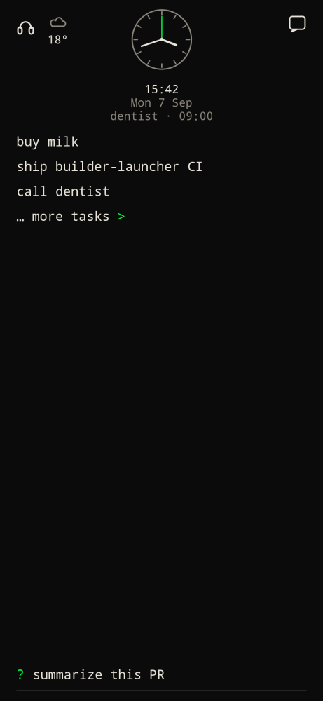
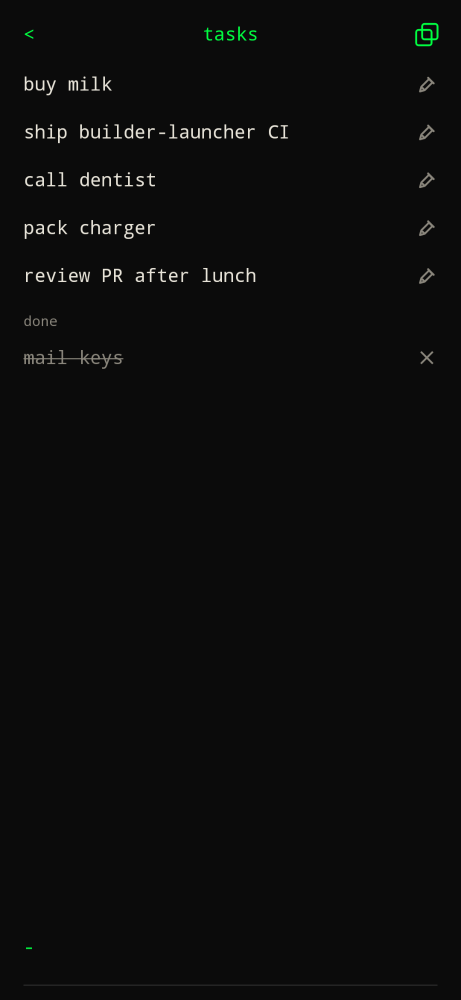

Home is empty on purpose. There is no icon grid.

| Piece | What it does |
| --- | --- |
| Clock | Large time, weekday, date. Tap it for [clock](clock/) (timer, alarm, time zones). |
| Weather | Current condition under the date. Tap it for the [weather](weather/) forecast. [Configure weather](../configure/weather/). |
| Open todos | Up to 3 open tasks. Tap to strike through; tap again to reopen. |
| `… more tasks >` | Always on home. Opens the full tasks list (no clock). `<` returns home. |
| Command bar | Bottom of the screen. Type, then Enter. |

Finished todos do **not** sit on home. They live on the tasks list under open items, newest completed first.

## Tasks list

On the tasks list the command bar starts in `-` task mode. The copy icon copies open todos to the clipboard as a markdown checklist dated `YYYY-MM-DD` (no share sheet).

See [Todos](todos/) for the `-` command.
