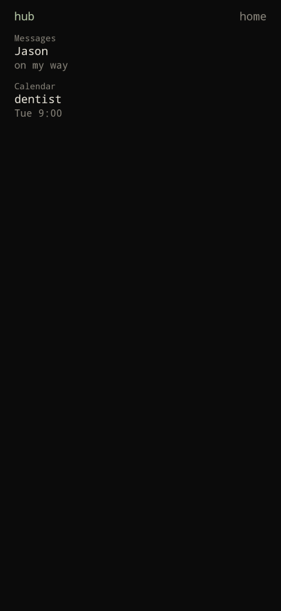
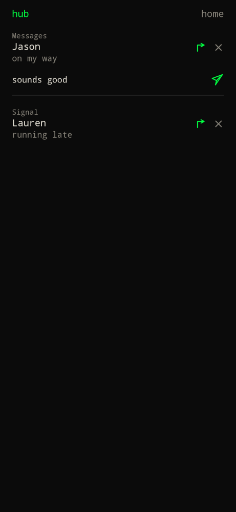
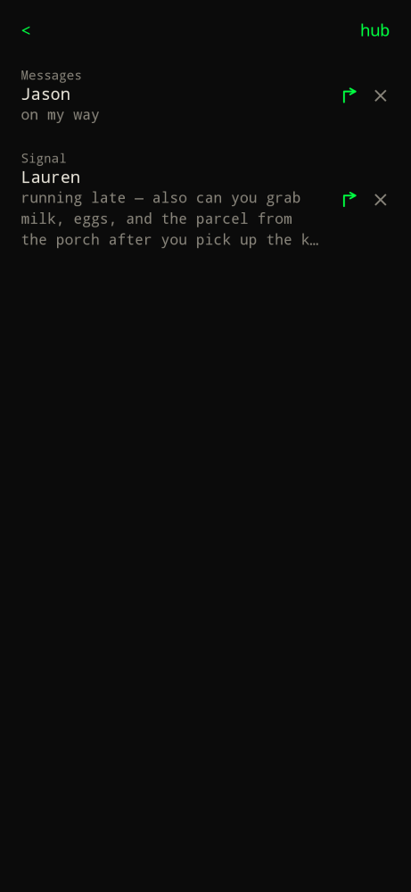

Type `hub` or press D-pad right.

The hub is **notifications only**. Todos stay on home / `… more tasks >`. Notes stay on `notes`.

1. Settings → **Notification access (hub)** and grant access for Builder Launcher.
2. Posted notifications appear here (up to 80). Long message bodies clip to 3 lines.
3. Tap the message to open it in the source app. Reply stays on the arrow.
4. Inline reply shows a field with a paper-airplane send icon on the right.
5. Dismiss removes it from the hub (and the system shade when the listener can).

Without access the hub explains that you need to grant notification access.
