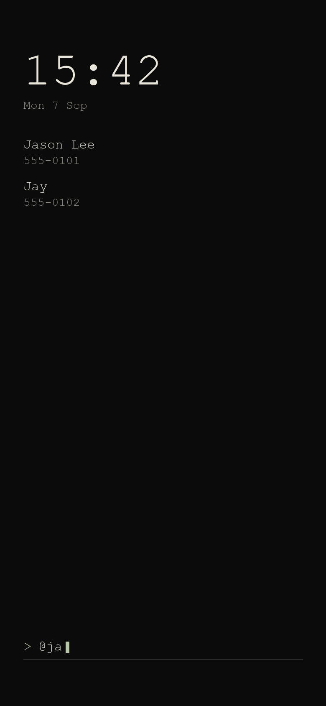
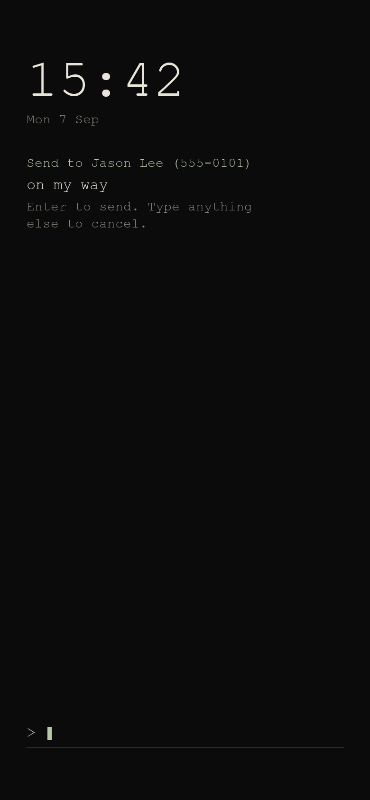

Prefix `@`.

1. Type `@` then a name or number. Matches complete as you type (contacts permission).
2. Add the message after the name: `@jason on my way!`
3. Enter drafts the SMS in the launcher.
4. Enter again (or type `send`) to send.

A number with digits and no letters is used as-is. Several contacts: pick from the list. No match: "No contact matches". Name without a body: "Add a message after the name".

If SMS permission is missing, the system Messages app opens with the draft instead.
