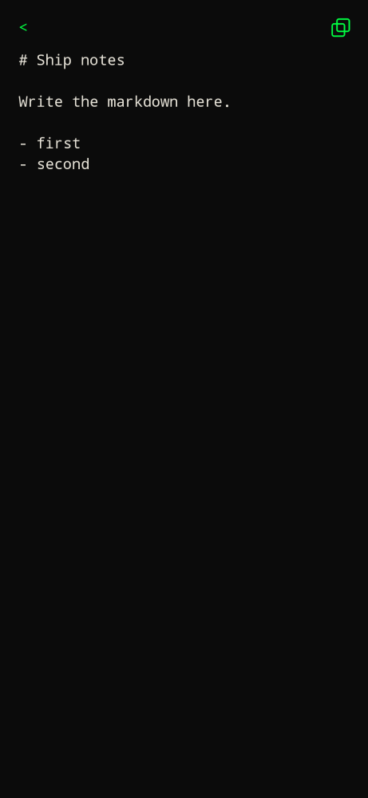

Prefix `+`. Type `+` and write, or type `notes`.

App search that looks like "Notes" also shows `… all notes >` so you do not open some other Notes app by mistake.

## Editor

- First line is seeded with `# ` if it is not already a heading.
- Markdown in the body (`#`, lists, etc.).
- `<` saves and goes home.
- Copy icon (top right) copies the note.

## List

Type `notes` or tap `… all notes >`. Notes sort by date edited. The first line (heading stripped) is the title; untitled if blank. Delete is on the right.

