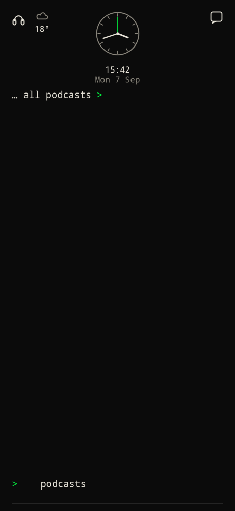
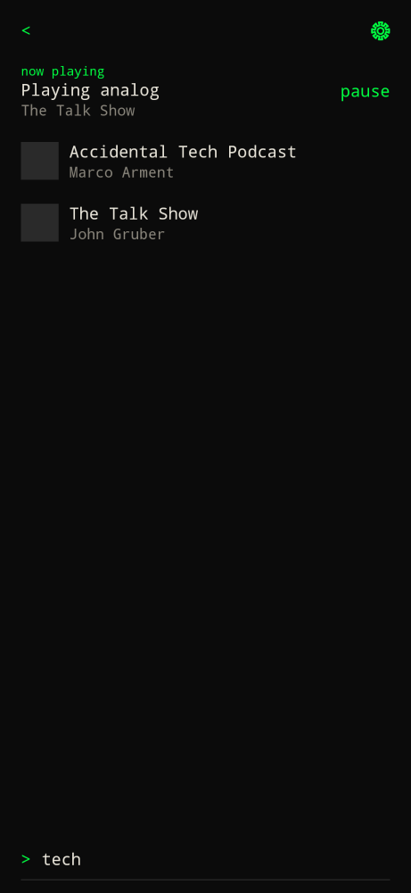
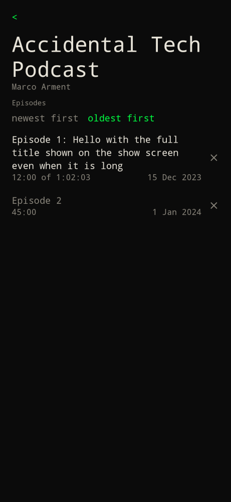
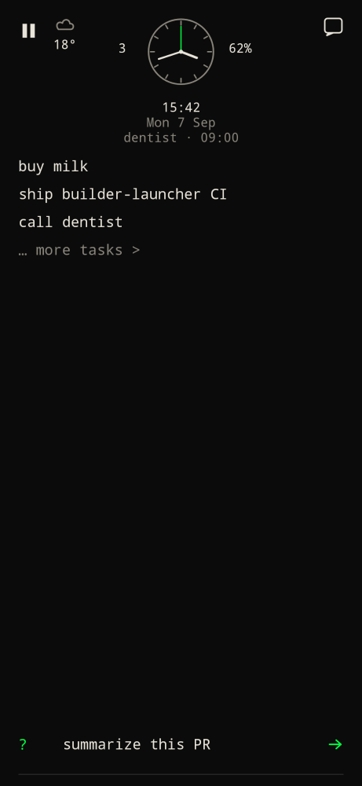
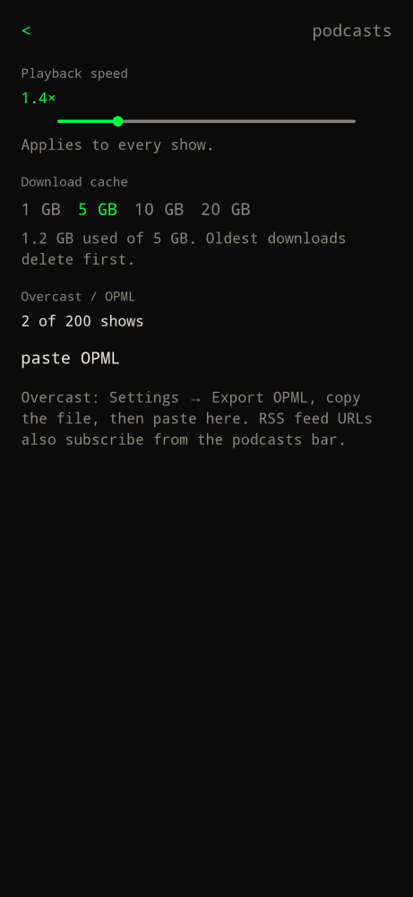

Type `podcasts`, `/podcasts`, or tap `… all podcasts >`.

There is no live Overcast account sync. Export OPML from Overcast (Settings → Export OPML), copy it, and paste on podcasts settings.

## Home list

Order:

1. **now playing** bar under back/gear when an episode is loaded and not finished. Tap the title for the episode screen. **play** / **pause** on the right. The bar stays up while you search.
2. **recent** — up to 3 unfinished plays, most recently listened, excluding the current episode. Tap to play without leaving the list. × dismisses it (skipped, reversible).
3. **next 5 episodes** — newest episodes that are not finished or skipped. Titles wrap to 3 lines. Show names stay on one line. Tap to play. × skips.
4. **podcasts** — every subscription, A–Z. An × on the right unsubscribes, same as notes and todos.

Empty list: `Type a show name, RSS URL, or paste Overcast OPML.`

- Type a show name to search the Apple podcast catalog. Hits show artwork on the left. Tap a hit to subscribe and open that show.
- Paste an RSS URL in the bar to subscribe.
- Gear opens podcasts settings.
- `<` returns home.

## Show

Open a subscription. Episode titles are shown in full. Length (or resume position) sits under the title on the left; the publish date sits on the right. Skipped episodes are grey. Tap a grey title to restore it. × skips or restores. Episodes default to **newest first**. Switch to **oldest first** on that show if you want to listen from the beginning. The choice is saved per show. Unsubscribe from the podcasts list.

## Episode

- **play** / **pause** streams the enclosure, or the downloaded file when it exists.
- **download** sits to the right of the `12:00 of 45:00` line. It keeps the audio in the on-device cache and shows percent while it runs. Finished episodes delete their download.
- Drag the progress bar. It sits inset from the screen edges so a side back gesture is not triggered. **−15** / **+15** skip 15 seconds.
- Speed is a label (`1.4×`). Tap it for podcasts settings. Default speed is 1× through 3× in 0.2 steps and applies to every show.
- Position is saved. Play again resumes where you left off. Near the end counts as finished and hides the now playing bar.
- **Show notes** from the feed sit under the player. Timestamps (`0:00`, `12:34`, `1:02:03`) are links; tap one to jump there.

While audio is playing, a headphones mark sits next to weather on home. Tap it for the current episode. Lock screen and headset controls use Android media playback (title, show, play/pause).

Search uses Apple's iTunes podcast catalog (not Overcast). Type a show name on the podcasts screen. Overcast is only for OPML import.

## Settings

Tap the gear on the podcasts list.

**Playback speed:** 1× through 3× in 0.2 steps. Default 1×. Applies to every show, including the episode that is playing.

**Download cache:** `1 GB` / `5 GB` (default) / `10 GB` / `20 GB`. Oldest downloads delete first when the cap is exceeded. The episode that is playing is kept. Played episodes are removed from the cache.

**paste OPML:** Overcast export, or any OPML with `xmlUrl` RSS outlines. Feeds are ordinary RSS with enclosures.
