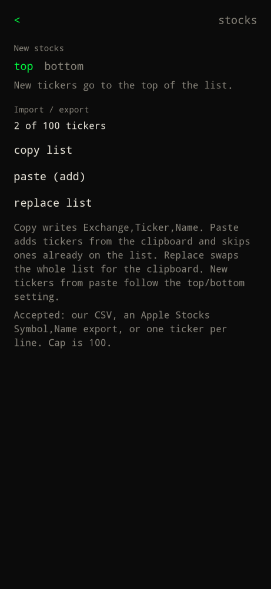

Prefix `$`. Type `stocks`, or tap `… all stocks >`.

Home shows one watchlist name at a time to the right of the clock (today's percent in green or red). It swaps every 5 seconds. Tap it for that ticker's chart. Hidden when the list is empty.

## Watchlist

Each row is ticker, company, last price, and today's percent (green up, red down). Cap is 100 names.

- Tap a row for the chart.
- Delete on the right removes it from the watchlist.
- Long-press and drag a row to reorder. Order is saved on the device.
- Command bar stays in `$` mode. Type a symbol or company name to search.
- Empty list: `Type $AAPL to add a ticker.`
- Gear (top right) opens stocks settings.
- `<` returns home.

## Add a ticker

| You type | Result |
| --- | --- |
| `$` or `stocks` | Open the list |
| `$AAPL` | Search that symbol and add when you pick it |
| `$ apple` | Search by name |
| `stock` / `/stocks` | Same as `stocks` |

App search that looks like "stocks" shows `… all stocks >`.

## Chart and stats

Timeframes: **1D / 1W / 1M / 3M / 1Y / 5Y**. Under the regular close, **Pre-Market** or **After Hours** shows when Yahoo has it (US names usually; LSE, TSX, crypto usually not). Stats: open, high, low, volume, P/E, market cap, EPS, yield, beta, average volume, 52-week high/low. CAGR for 1Y / 3Y / 5Y / 10Y sits under the stats.

Quotes, search, charts, and fundamentals come from Yahoo Finance. Home also refreshes quotes when the watchlist is not empty. Search and charts wait until you open stocks or pick a ticker.

## Stocks settings

Tap the gear on the watchlist.

**New stocks:** `top` (default) or `bottom` for `$AAPL` adds and paste-to-add.

**Import / export:**

| Action | Result |
| --- | --- |
| copy list | Writes `Exchange,Ticker,Name` CSV to the clipboard (no share sheet) |
| paste (add) | Adds tickers from the clipboard; skips ones already on the list |
| replace list | Swaps the whole list for the clipboard |

Accepted clipboard formats:

| Format | Example |
| --- | --- |
| Builder export | `Exchange,Ticker,Name` then rows |
| Apple Stocks | `Symbol,Name,…` |
| One ticker per line | `AAPL` |
| `Symbol,Name` | `AAPL,Apple Inc.` |

You can also Enter a CSV (or several lines) in the `$` bar on the watchlist. Duplicates collapse by ticker. Cap is 100.
