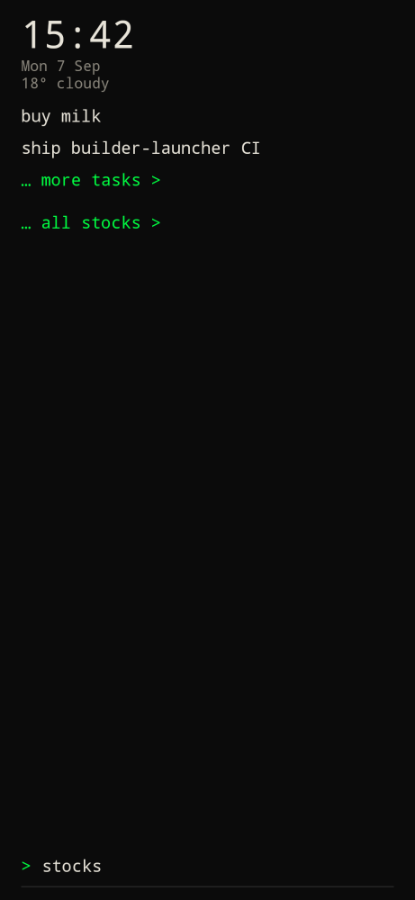
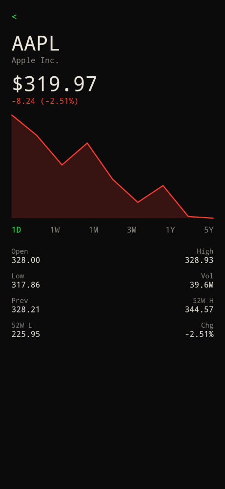

Prefix `$`. Type `stocks`, or tap `… all stocks >`.

## Watchlist

Each row is ticker, company, last price, and today's percent (green up, red down). Cap is 20 names.

- Tap a row for the chart.
- Delete on the right removes it.
- Command bar stays in `$` mode. Type a symbol or company name to search.
- Empty list: `Type $AAPL to add a ticker. Paste a CSV to import.`
- `<` returns home.

## Add a ticker

| You type | Result |
| --- | --- |
| `$` or `stocks` | Open the list |
| `$AAPL` | Search that symbol and add when you pick it |
| `$ apple` | Search by name |
| `stock` / `/stocks` | Same as `stocks` |

App search that looks like "stocks" shows `… all stocks >`.

## Chart and stats

Timeframes: **1D / 1W / 1M / 3M / 1Y / 5Y**. Stats box: open, high, low, volume, previous close, 52-week high/low, change.

Quotes, search, and charts come from Yahoo Finance. Nothing is sent until you open stocks or search a ticker.

## Copy and paste CSV

On the watchlist header:

- **Copy** writes `Exchange,Ticker,Name` CSV to the clipboard (no share sheet).
- **Paste** imports from the clipboard.

You can also Enter a CSV (or several lines) in the `$` bar. Accepted:

| Format | Example |
| --- | --- |
| Builder export | `Exchange,Ticker,Name` then rows |
| Apple Stocks | `Symbol,Name,…` |
| One ticker per line | `AAPL` |
| `Symbol,Name` | `AAPL,Apple Inc.` |

Duplicates collapse by ticker. After a paste the bar stays in `$` mode with an empty field so you are not left typing the CSV.
