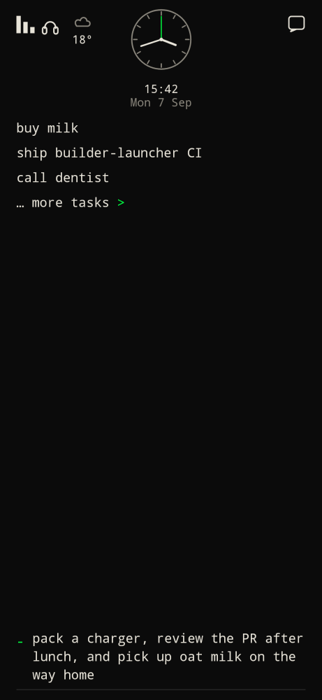
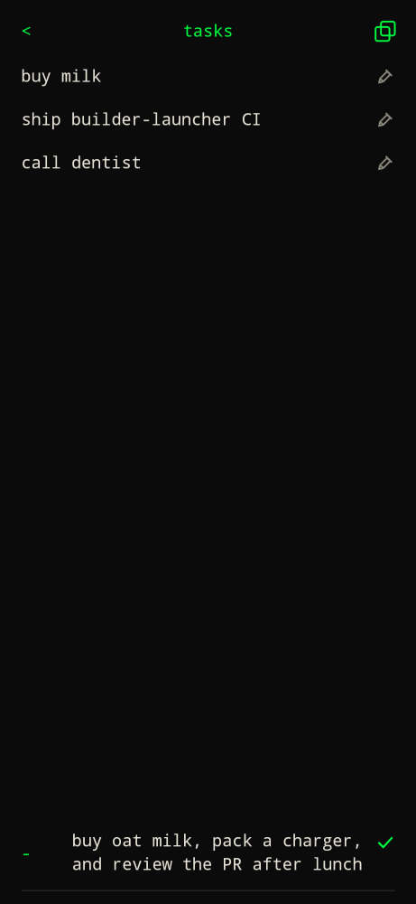

Prefix `-`. Example: `-buy milk`.


- Saved locally on the device (not in a cloud todo app).
- Long tasks wrap in the bar on home and on the tasks page after they no longer fit on one line. Enter still saves.


- Home shows up to 3 **open** todos.
- Tap a line to complete it (strikethrough). Tap again to reopen, including on the full list under **done**.
- `… more tasks >` is always on home and opens the full list.




On the tasks page:

- Title `tasks` is centered at the top. Copy stays top right.

- Command bar starts with `-` so the next Enter saves another todo.
- Pencil on the right (before delete) loads that task into the bar. A check on the right of the bar saves the edit.
- `<` or Back returns home in default command-bar mode (not task mode).
- Long-press and drag an open row across the list to reorder. Other rows slide out of the way as you pass them. Order is saved on the device. Home preview stays tap-only.
- Copy icon writes open todos to the clipboard as:

  ```markdown
  ## 2026-09-07
  - [ ] buy milk
  ```

Completed items sort newest-finished first and stay off the home list. Today's completed count sits left of the analog clock. `/usage` also lists completed tasks per day at the bottom.
