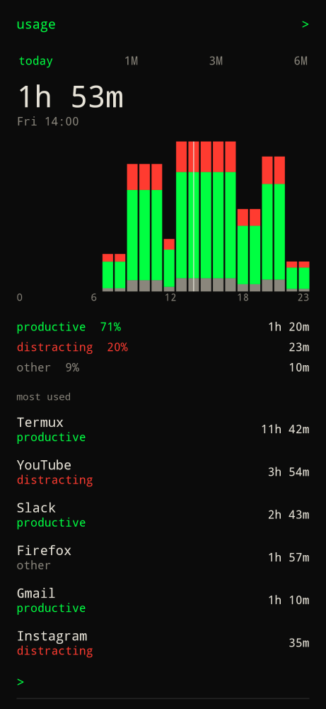

Type `/usage` on [home](home/). There is no unprefixed `usage` command, home mark, or swipe.

Android keeps the totals. Builder Launcher does not upload them. Grant **Usage access** the first time (also in [settings](../../configure/settings/)).

| Piece | What it does |
| --- | --- |
| 1W / 1M | **1W** is the default: seven daily bars. **1M** is the last 30 days. There is no today/hourly view — Android usage stats are not reliable by hour. |
| Total | Time in the foreground for the selected range, or for the pressed bar. |
| vs last week | Shown for **1W** until you press a bar. |
| Pickups | Screen-on events for the selected range. |
| Chart | Stacked bars: productive (accent), distracting (red), other (dim). Press or drag a bar to read that day. |
| Breakdown | Share of productive / distracting / other for the range, or for the pressed bar. |
| Most used | Top apps in the range, or in the pressed day. Tap a row to cycle **other → productive → distracting**. Your choice sticks on the device. |

YouTube, Instagram, and similar apps start as distracting. Termux, Slack, Gmail, calendars, and maps start as productive. Everything else starts as other, including this launcher and browsers.

Settings → **Home apps** → **Pin time** `on` also shows today's minutes and share of phone time under each pin on home, as `30m` then `17%` on the next line. Green if productive, red if not.

`<` or Back returns home.
