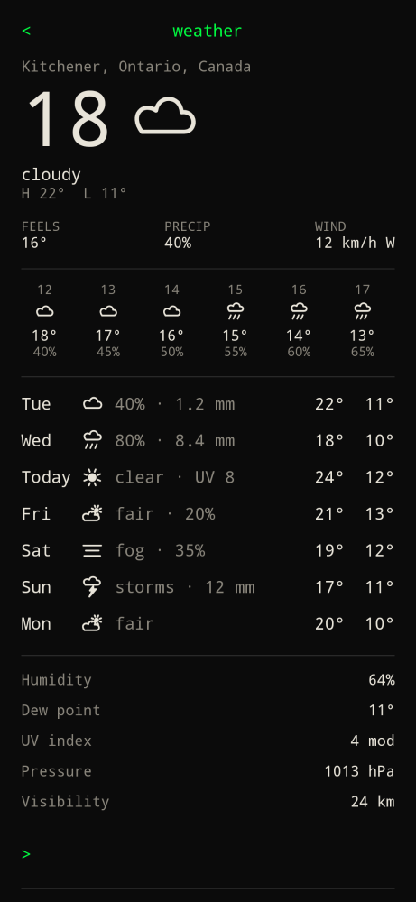

Tap the weather mark between the clock and the ticker on [home](home/), or type `weather` / `/weather`.

The screen follows the usual forecast layout: large temperature with a weather illustration to its right, feels / precip / wind, next 24 hours, seven days, then humidity, dew point, UV, pressure, visibility, cloud cover, sunrise / sunset, wind, gusts, and air quality.

Data comes from Open-Meteo (plus Open-Meteo air quality). Units follow the metric / imperial setting. Set the city in [settings](../configure/weather/). `<` returns home.
